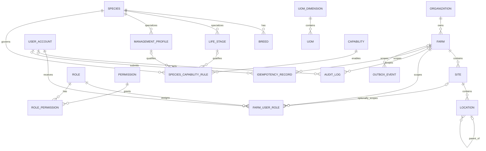

# Foundation ERD

```mermaid
erDiagram
  ORGANIZATION ||--o{ FARM : owns
  FARM ||--o{ SITE : contains
  SITE ||--o{ LOCATION : contains
  LOCATION o|--o{ LOCATION : parent_of

  USER_ACCOUNT ||--o{ FARM_USER_ROLE : receives
  FARM ||--o{ FARM_USER_ROLE : scopes
  SITE o|--o{ FARM_USER_ROLE : optionally_scopes
  ROLE ||--o{ FARM_USER_ROLE : assigns
  ROLE ||--o{ ROLE_PERMISSION : has
  PERMISSION ||--o{ ROLE_PERMISSION : grants

  UOM_DIMENSION ||--o{ UOM : contains

  SPECIES ||--o{ BREED : has
  SPECIES ||--o{ LIFE_STAGE : specializes
  SPECIES ||--o{ MANAGEMENT_PROFILE : specializes
  SPECIES ||--o{ SPECIES_CAPABILITY_RULE : governs
  CAPABILITY ||--o{ SPECIES_CAPABILITY_RULE : enables
  LIFE_STAGE o|--o{ SPECIES_CAPABILITY_RULE : qualifies
  MANAGEMENT_PROFILE o|--o{ SPECIES_CAPABILITY_RULE : qualifies

  FARM o|--o{ AUDIT_LOG : scopes
  USER_ACCOUNT o|--o{ AUDIT_LOG : acts
  FARM o|--o{ IDEMPOTENCY_RECORD : scopes
  USER_ACCOUNT o|--o{ IDEMPOTENCY_RECORD : submits
  FARM o|--o{ OUTBOX_EVENT : scopes
```

## Important
This ERD is the **foundation**, not the final ERP ERD. Livestock, inventory, feed and later domains will extend it in subsequent passes.
