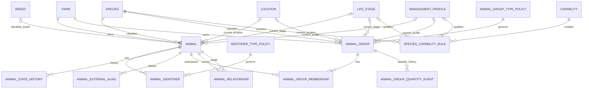

# Database Pass 2 — Livestock ERD

## Physical subject model
There is intentionally no `livestock_subject` table in Pass 2. Later feed/health/production association tables that support both individuals and groups will use explicit constrained FKs or typed association tables.
