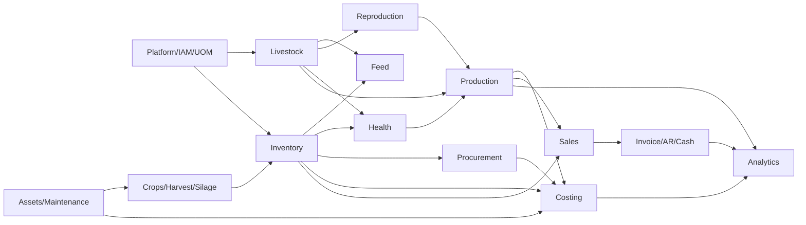

# Database Baseline v1 — Master Domain ERD

This is a dependency/navigation map, not permission for direct cross-module mutation. Detailed columns and constraints remain in the domain schema documents.
