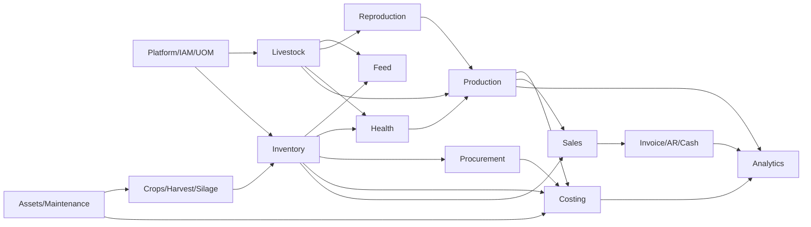

# Database Baseline v1 — Master Domain ERD


```mermaid
flowchart LR
 P[Platform/IAM/UOM] --> L[Livestock]
 P --> I[Inventory]
 L --> F[Feed]
 I --> F
 L --> R[Reproduction]
 L --> H[Health]
 I --> H
 L --> PR[Production]
 R --> PR
 H --> PR
 I --> PO[Procurement]
 PO --> C[Costing]
 I --> C
 PR --> C
 CR[Crops/Harvest/Silage] --> I
 A[Assets/Maintenance] --> CR
 A --> C
 PR --> S[Sales]
 I --> S
 S --> FI[Invoice/AR/Cash]
 C --> AN[Analytics]
 FI --> AN
 PR --> AN
```

This is a dependency/navigation map, not permission for direct cross-module mutation. Detailed columns and constraints remain in the domain schema documents.

## Feed Performance Intelligence dependency view
```text
Supplier → Ingredient Inventory Lot → Feed Batch Component → Feed Batch/Output Lot
                                                        ↓
                                                Feeding Event/Exposure
                                                        ↓
Animal/Group → Production/Milk ← Health/Lifecycle/Context
                                                        ↓
                                      Feed Performance Assessment/Alert
                                                        ↓
                                   Supplier/Batch Performance + Economics
```
All arrows into the intelligence layer are analytical dependencies; intelligence output does not overwrite upstream facts.

