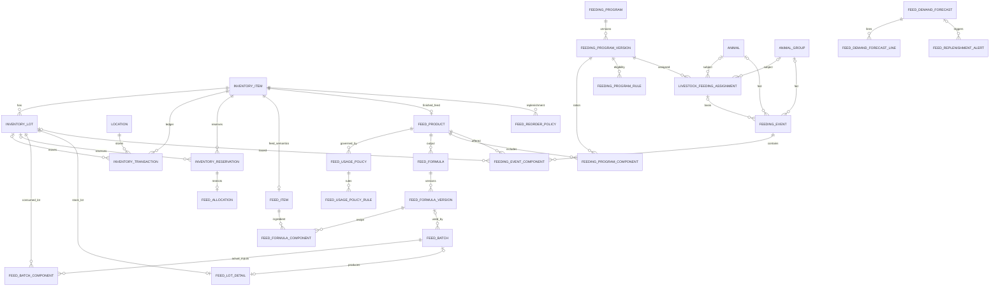

# Database Pass 3 — Inventory & Feed ERD

```mermaid
erDiagram
 INVENTORY_ITEM ||--o{ INVENTORY_LOT : has
 INVENTORY_ITEM ||--o{ INVENTORY_TRANSACTION : ledger
 INVENTORY_LOT o|--o{ INVENTORY_TRANSACTION : moves
 LOCATION ||--o{ INVENTORY_TRANSACTION : stores
 INVENTORY_ITEM ||--o{ INVENTORY_RESERVATION : reserves
 INVENTORY_LOT o|--o{ INVENTORY_RESERVATION : reserves

 INVENTORY_ITEM ||--o| FEED_ITEM : feed_semantics
 INVENTORY_ITEM ||--o| FEED_PRODUCT : finished_feed
 FEED_PRODUCT ||--o{ FEED_USAGE_POLICY : governed_by
 FEED_USAGE_POLICY ||--o{ FEED_USAGE_POLICY_RULE : rules

 FEED_PRODUCT ||--o{ FEED_FORMULA : output
 FEED_FORMULA ||--o{ FEED_FORMULA_VERSION : versions
 FEED_FORMULA_VERSION ||--o{ FEED_FORMULA_COMPONENT : recipe
 FEED_ITEM ||--o{ FEED_FORMULA_COMPONENT : ingredient

 FEED_FORMULA_VERSION o|--o{ FEED_BATCH : used_by
 FEED_BATCH ||--o{ FEED_BATCH_COMPONENT : actual_inputs
 INVENTORY_LOT ||--o{ FEED_BATCH_COMPONENT : consumed_lot
 FEED_BATCH o|--o| FEED_LOT_DETAIL : produces
 INVENTORY_LOT ||--o| FEED_LOT_DETAIL : stock_lot

 FEEDING_PROGRAM ||--o{ FEEDING_PROGRAM_VERSION : versions
 FEEDING_PROGRAM_VERSION ||--o{ FEEDING_PROGRAM_COMPONENT : ration
 FEED_PRODUCT ||--o{ FEEDING_PROGRAM_COMPONENT : includes
 FEEDING_PROGRAM_VERSION ||--o{ FEEDING_PROGRAM_RULE : eligibility

 FEEDING_PROGRAM_VERSION ||--o{ LIVESTOCK_FEEDING_ASSIGNMENT : assigned
 ANIMAL o|--o{ LIVESTOCK_FEEDING_ASSIGNMENT : subject
 ANIMAL_GROUP o|--o{ LIVESTOCK_FEEDING_ASSIGNMENT : subject

 LIVESTOCK_FEEDING_ASSIGNMENT o|--o{ FEEDING_EVENT : basis
 ANIMAL o|--o{ FEEDING_EVENT : fed
 ANIMAL_GROUP o|--o{ FEEDING_EVENT : fed
 FEEDING_EVENT ||--o{ FEEDING_EVENT_COMPONENT : contains
 FEED_PRODUCT ||--o{ FEEDING_EVENT_COMPONENT : offered
 INVENTORY_LOT o|--o{ FEEDING_EVENT_COMPONENT : traced

 INVENTORY_RESERVATION ||--o| FEED_ALLOCATION : restricts
 INVENTORY_ITEM ||--o{ FEED_REORDER_POLICY : replenishment
 FEED_DEMAND_FORECAST ||--o{ FEED_DEMAND_FORECAST_LINE : lines
 FEED_DEMAND_FORECAST o|--o{ FEED_REPLENISHMENT_ALERT : triggers
```
