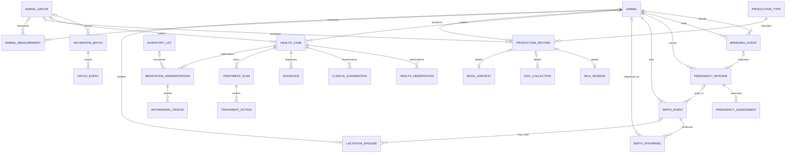

# Database Pass 4 — Reproduction, Health & Production ERD

```mermaid
erDiagram
 ANIMAL ||--o{ BREEDING_EVENT : female
 ANIMAL o|--o{ BREEDING_EVENT : male
 ANIMAL ||--o{ PREGNANCY_EPISODE : carries
 BREEDING_EVENT o|--o{ PREGNANCY_EPISODE : originates
 PREGNANCY_EPISODE ||--o{ PREGNANCY_ASSESSMENT : assessed
 PREGNANCY_EPISODE o|--o{ BIRTH_EVENT : ends_in
 ANIMAL ||--o{ BIRTH_EVENT : dam
 BIRTH_EVENT ||--o{ BIRTH_OFFSPRING : produces
 ANIMAL o|--o{ BIRTH_OFFSPRING : registered_as
 ANIMAL_GROUP o|--o{ INCUBATION_BATCH : source
 INCUBATION_BATCH ||--o{ HATCH_EVENT : results

 ANIMAL o|--o{ HEALTH_CASE : subject
 ANIMAL_GROUP o|--o{ HEALTH_CASE : subject
 HEALTH_CASE ||--o{ HEALTH_OBSERVATION : observations
 HEALTH_CASE ||--o{ CLINICAL_EXAMINATION : examinations
 HEALTH_CASE ||--o{ DIAGNOSIS : diagnoses
 HEALTH_CASE ||--o{ TREATMENT_PLAN : plans
 TREATMENT_PLAN ||--o{ TREATMENT_ACTION : actions
 HEALTH_CASE ||--o{ MEDICATION_ADMINISTRATION : medications
 INVENTORY_LOT o|--o{ MEDICATION_ADMINISTRATION : consumed
 MEDICATION_ADMINISTRATION ||--o{ WITHDRAWAL_PERIOD : creates

 PRODUCTION_TYPE ||--o{ PRODUCTION_RECORD : classifies
 ANIMAL o|--o{ PRODUCTION_RECORD : produces
 ANIMAL_GROUP o|--o{ PRODUCTION_RECORD : produces
 PRODUCTION_RECORD o|--o| MILK_SESSION : details
 PRODUCTION_RECORD o|--o| EGG_COLLECTION : details
 PRODUCTION_RECORD o|--o| WOOL_HARVEST : details
 ANIMAL o|--o{ ANIMAL_MEASUREMENT : measured
 ANIMAL_GROUP o|--o{ ANIMAL_MEASUREMENT : measured
 ANIMAL ||--o{ LACTATION_EPISODE : lactates
 BIRTH_EVENT o|--o{ LACTATION_EPISODE : may_start
```
