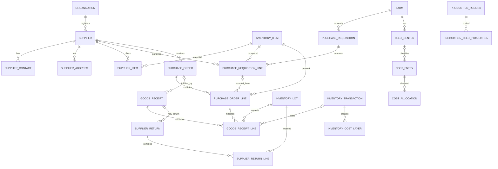

# Database Pass 5 — Procurement & Costing ERD

```mermaid
erDiagram
 ORGANIZATION ||--o{ SUPPLIER : registers
 SUPPLIER ||--o{ SUPPLIER_CONTACT : has
 SUPPLIER ||--o{ SUPPLIER_ADDRESS : has
 SUPPLIER ||--o{ SUPPLIER_ITEM : offers
 INVENTORY_ITEM ||--o{ SUPPLIER_ITEM : mapped

 FARM ||--o{ PURCHASE_REQUISITION : requests
 PURCHASE_REQUISITION ||--o{ PURCHASE_REQUISITION_LINE : contains
 INVENTORY_ITEM ||--o{ PURCHASE_REQUISITION_LINE : requested
 SUPPLIER o|--o{ PURCHASE_REQUISITION_LINE : preferred

 SUPPLIER ||--o{ PURCHASE_ORDER : receives
 PURCHASE_ORDER ||--o{ PURCHASE_ORDER_LINE : contains
 PURCHASE_REQUISITION_LINE o|--o{ PURCHASE_ORDER_LINE : sourced_from
 INVENTORY_ITEM ||--o{ PURCHASE_ORDER_LINE : ordered

 PURCHASE_ORDER o|--o{ GOODS_RECEIPT : fulfilled_by
 GOODS_RECEIPT ||--o{ GOODS_RECEIPT_LINE : contains
 PURCHASE_ORDER_LINE o|--o{ GOODS_RECEIPT_LINE : matches
 INVENTORY_LOT o|--o{ GOODS_RECEIPT_LINE : creates
 INVENTORY_TRANSACTION o|--o{ GOODS_RECEIPT_LINE : posts

 GOODS_RECEIPT o|--o{ SUPPLIER_RETURN : may_return
 SUPPLIER_RETURN ||--o{ SUPPLIER_RETURN_LINE : contains
 INVENTORY_LOT ||--o{ SUPPLIER_RETURN_LINE : returned

 FARM ||--o{ COST_CENTER : has
 COST_CENTER o|--o{ COST_ENTRY : classifies
 INVENTORY_TRANSACTION ||--o{ INVENTORY_COST_LAYER : creates
 COST_ENTRY ||--o{ COST_ALLOCATION : allocated
 PRODUCTION_RECORD ||--o{ PRODUCTION_COST_PROJECTION : costed
```
