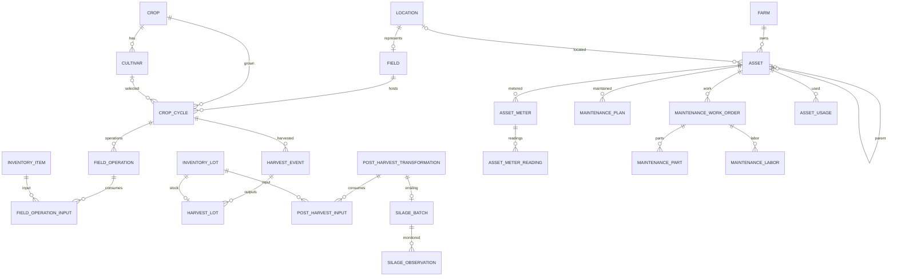

# Database Pass 6 — Crops, Harvest, Silage & Assets ERD

```mermaid
erDiagram
 LOCATION ||--o| FIELD : represents
 FIELD ||--o{ CROP_CYCLE : hosts
 CROP ||--o{ CULTIVAR : has
 CROP ||--o{ CROP_CYCLE : grown
 CULTIVAR o|--o{ CROP_CYCLE : selected
 CROP_CYCLE ||--o{ FIELD_OPERATION : operations
 FIELD_OPERATION ||--o{ FIELD_OPERATION_INPUT : consumes
 INVENTORY_ITEM ||--o{ FIELD_OPERATION_INPUT : input
 CROP_CYCLE ||--o{ HARVEST_EVENT : harvested
 HARVEST_EVENT ||--o{ HARVEST_LOT : outputs
 INVENTORY_LOT ||--o| HARVEST_LOT : stock

 POST_HARVEST_TRANSFORMATION ||--o{ POST_HARVEST_INPUT : consumes
 INVENTORY_LOT ||--o{ POST_HARVEST_INPUT : input
 POST_HARVEST_TRANSFORMATION ||--o| SILAGE_BATCH : ensiling
 SILAGE_BATCH ||--o{ SILAGE_OBSERVATION : monitored

 FARM ||--o{ ASSET : owns
 LOCATION o|--o{ ASSET : located
 ASSET o|--o{ ASSET : parent
 ASSET ||--o{ ASSET_METER : metered
 ASSET_METER ||--o{ ASSET_METER_READING : readings
 ASSET ||--o{ MAINTENANCE_PLAN : maintained
 ASSET ||--o{ MAINTENANCE_WORK_ORDER : work
 MAINTENANCE_WORK_ORDER ||--o{ MAINTENANCE_PART : parts
 MAINTENANCE_WORK_ORDER ||--o{ MAINTENANCE_LABOR : labor
 ASSET ||--o{ ASSET_USAGE : used
```
