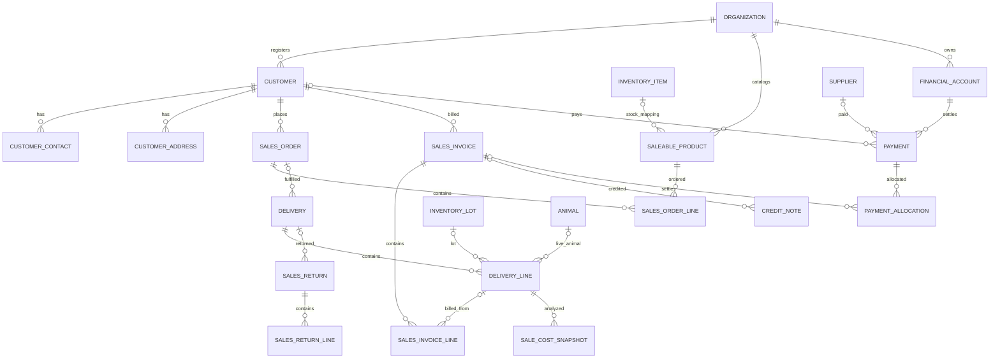

# Database Pass 7 — Sales, Receivables & Cash ERD

```mermaid
erDiagram
 ORGANIZATION ||--o{ CUSTOMER : registers
 CUSTOMER ||--o{ CUSTOMER_CONTACT : has
 CUSTOMER ||--o{ CUSTOMER_ADDRESS : has
 ORGANIZATION ||--o{ SALEABLE_PRODUCT : catalogs
 INVENTORY_ITEM o|--o{ SALEABLE_PRODUCT : stock_mapping

 CUSTOMER ||--o{ SALES_ORDER : places
 SALES_ORDER ||--o{ SALES_ORDER_LINE : contains
 SALEABLE_PRODUCT ||--o{ SALES_ORDER_LINE : ordered
 SALES_ORDER o|--o{ DELIVERY : fulfilled
 DELIVERY ||--o{ DELIVERY_LINE : contains
 INVENTORY_LOT o|--o{ DELIVERY_LINE : lot
 ANIMAL o|--o{ DELIVERY_LINE : live_animal

 DELIVERY o|--o{ SALES_RETURN : returned
 SALES_RETURN ||--o{ SALES_RETURN_LINE : contains

 CUSTOMER ||--o{ SALES_INVOICE : billed
 SALES_INVOICE ||--o{ SALES_INVOICE_LINE : contains
 DELIVERY_LINE o|--o{ SALES_INVOICE_LINE : billed_from
 SALES_INVOICE o|--o{ CREDIT_NOTE : credited

 ORGANIZATION ||--o{ FINANCIAL_ACCOUNT : owns
 CUSTOMER o|--o{ PAYMENT : pays
 SUPPLIER o|--o{ PAYMENT : paid
 FINANCIAL_ACCOUNT ||--o{ PAYMENT : settles
 PAYMENT ||--o{ PAYMENT_ALLOCATION : allocated
 SALES_INVOICE o|--o{ PAYMENT_ALLOCATION : settles

 DELIVERY_LINE ||--o{ SALE_COST_SNAPSHOT : analyzed
```
